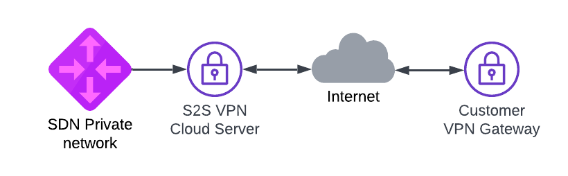

# Terraform Site-to-Site VPN demo

Please note that this is just an example on how you can use Terraform with [UpCloud](https://upcloud.com/) 
and should not be used in production as is. Please see [LICENSE](LICENSE) for details.



## Usage

Demo uses [StrongSwan](https://www.strongswan.org/) to create IPSEC Site-to-Site VPN on top of UpCloud.

### Prerequisites

Project uses [Terraform](https://www.terraform.io/) and it needs to be installed. 
We're also using UpCloud's Terraform provider, but it should be automatically installed by 
running `terraform init` or with `make init`.

To create the resources with Terraform, you'll need your API credentials exported.

```
export UPCLOUD_USERNAME=your_username
export UPCLOUD_PASSWORD=your_password
```

You must also create `config.tfvars` file with your own settings:
 
```
remote_ip = "192.0.2.1" # Remote Site-to-Site VPN endpoint
remote_network = "10.0.0.0/24,10.1.0.0/24,10.2.0.0/24" # Subnetwork or list of subnetworks separated by comma located on the remote side of VPN tunnel
upcloud_network = "10.255.0.0/24" # Subnetwork for UpCloud side SDN private network 
ipsec_psk = "Y0urPr35h4r3dK3y" 
zone = "pl-waw1"
server_plan = "1xCPU-1GB"
ssh_key_public = "ssh-rsa AAAA_YOUR_SSH_PUBLIC_KEY"
```

Depending on remote VPN service setting you might need to change settings in `configs/ipsec.conf.tftpl`

### Quickstart

**IMPORTANT: Make sure your SSH-agent is running (execute this if not:
`eval$(ssh-agent) && ssh-add <path_to_private_key> && ssh-add -L`), so 
Terraform scripts can SSH into Cloud Servers using agent forwarding**


### Creating services with basic configuration

Initiate the project and install providers.

```
make init
```

Demo can now be created with Terraform. Creation takes around 10 minutes.

```
make create
```

### Testing stuff

You should log in to VPN server and check if Site-to-Site VPN is up. 

```
bash# ipsec status
Security Associations (1 up, 0 connecting):
upcloud-to-remote-tunnel[2]: ESTABLISHED 2 minutes ago, 5.22.218.1[5.22.218.1]...5.22.220.218[5.22.220.218]
upcloud-to-remote-tunnel{2}:  INSTALLED, TUNNEL, reqid 2, ESP SPIs: ce7f4596_i c812cd30_o
upcloud-to-remote-tunnel{2}:   10.200.0.0/24 === 10.255.0.0/24
```

If you want to route all outgoing traffic via VPN Cloud server and use it as NAT gateway you can add following iptables 
rule to the VPN Cloud server.

```
iptables -t nat -A POSTROUTING -o eth0 -j MASQUERADE
```
### Destroying stuff

After testing things around its good to free the resources. Tearing the thing down is also just one command.

```
make destroy
```
